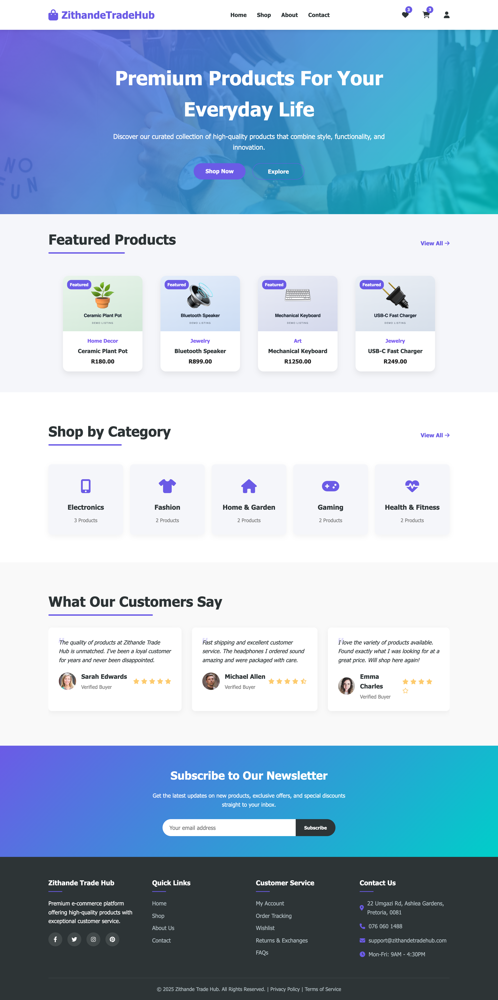
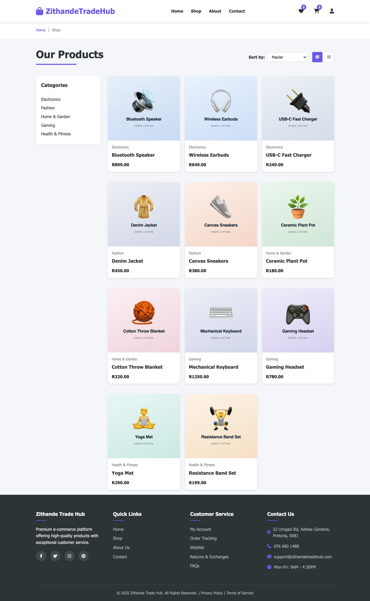
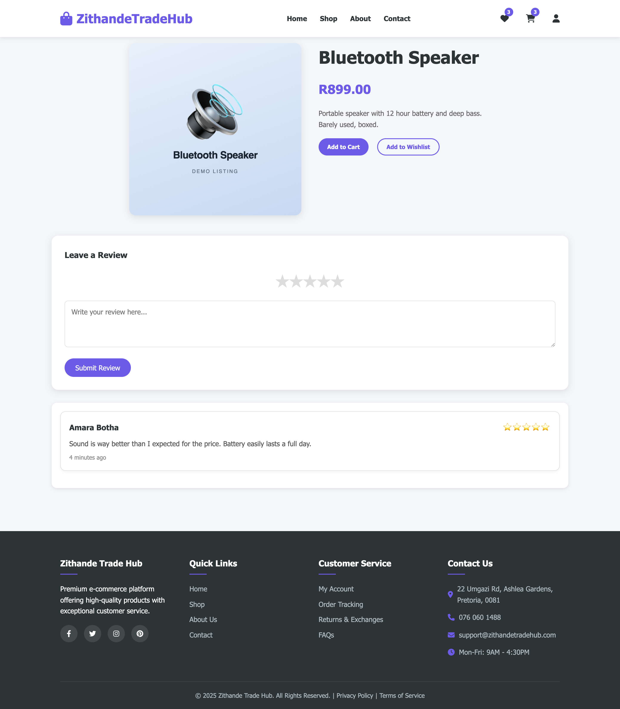
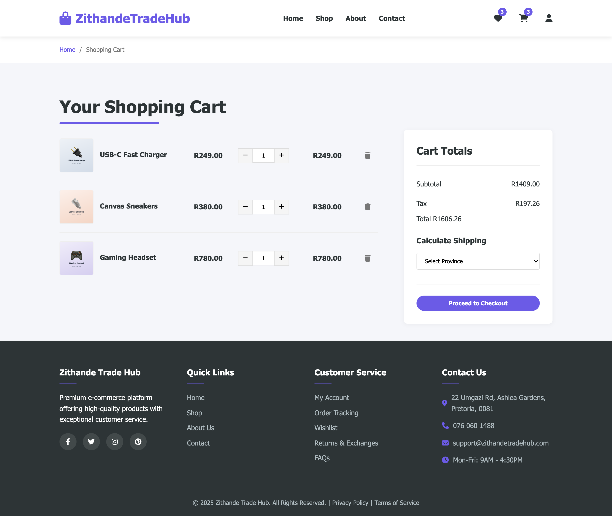
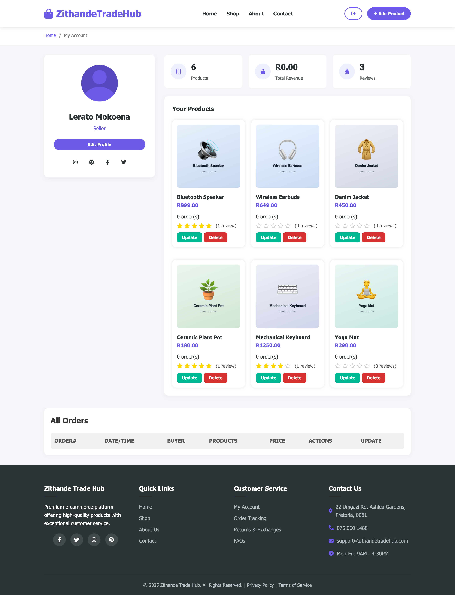
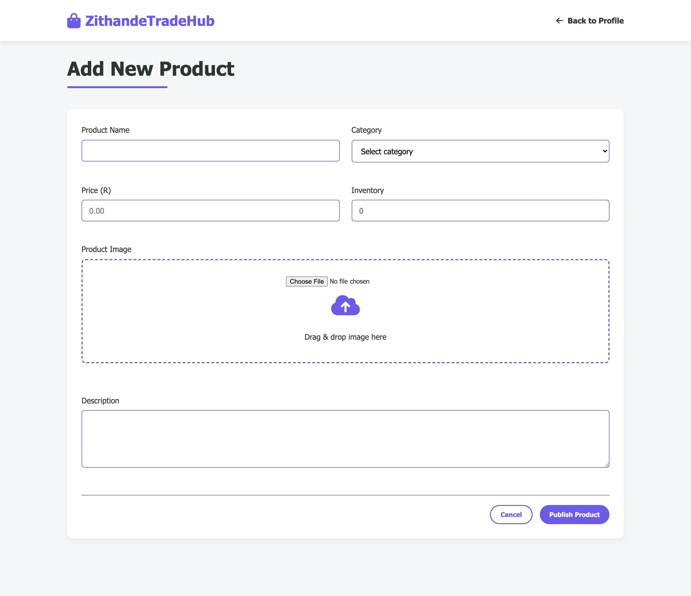
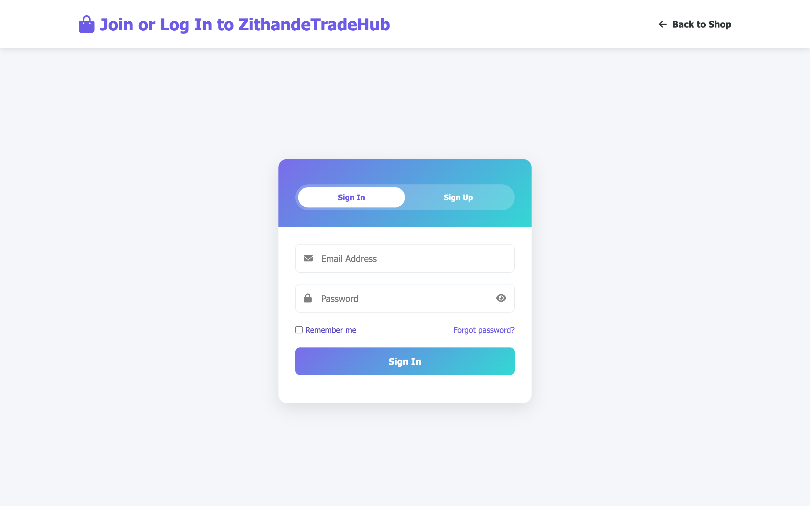

<h1 align="center">ZithandeTradeHub 🛍️</h1>

<p align="center">
  <strong>A C2C marketplace for South Africa.</strong><br/>
  Anyone can list what they have and anyone can buy it: a hoodie, a phone, something handmade.
  Sellers get a dashboard and analytics, buyers get a wishlist, cart and order tracking,
  and an admin console sits over the whole thing.
</p>

<p align="center">
  
  
  
  
  
  <a href="LICENSE"></a>
</p>

<p align="center">
  🇿🇦 Built for the South African market &nbsp;·&nbsp; 🤝 Peer to peer &nbsp;·&nbsp; 🎓 Eduvos project
</p>

---

## 📖 Table of Contents

- [✨ What is ZithandeTradeHub?](#-what-is-zithandetradehub)
- [🎥 Demo](#-demo)
- [🎬 Feature Tour](#-feature-tour)
- [⚡ Tech Stack](#-tech-stack)
- [🗄️ Database Schema](#️-database-schema)
- [🔌 API Reference](#-api-reference)
- [🚀 Quick Start](#-quick-start)
- [📁 Project Structure](#-project-structure)
- [🔒 Security Notes](#-security-notes)
- [📄 License](#-license)

---

## ✨ What is ZithandeTradeHub?

Most marketplaces are built for shops. This one is built for people: the same account can list a
product in the morning and buy something in the afternoon, and the interface changes to suit
whichever you are doing.

A **buyer** browses by category, filters and sorts, keeps a wishlist and a cart that survive a
refresh, checks out, and tracks the order afterwards. A **seller** gets a dashboard with revenue,
order count and listings, uploads products with a live image preview, and is stopped from
publishing the same product name twice. An **admin** sees the whole platform: every account, order,
product and review, with the numbers rolled up on one screen.

---

## 🎥 Demo

<p align="center"></p>

https://github.com/user-attachments/assets/322279d4-76c2-4fbe-879f-17d1e7b6b780

---

## 🎬 Feature Tour

> 📸 Every screenshot below is the app running locally against MySQL with a seeded demo
> catalogue. The product artwork is deliberately generic placeholder tiles, marked
> **demo listing**, rather than real product photography.

### 👤 Accounts and roles

Registration hashes passwords with **bcrypt** and stores a role of `buyer` or `seller`. Sessions are
cookie backed, and the dashboard you land on depends on the role on your account.

### 🛒 Buying

| | |
|---|---|
| ❤️ **Wishlist** | Toggle from any product card; the header counter follows you across pages |
| 🛍️ **Cart** | Quantity updates, line removal, and a live item count |
| 🔍 **Browse** | Sort by price, popularity or newest, filter by category, switch grid or list |
| 💳 **Checkout** | Turns the cart into an order plus its line items in one go |
| 📦 **Tracking** | Order status moves through pending → processing → shipped → delivered |
| ⭐ **Reviews** | Rate and review a product you have bought |

**🛍️ The shop.** Category filters, sorting, and a grid or list toggle, with live wishlist and cart
counters in the header.

<p align="center"></p>

<table>
<tr>
<td width="50%"><strong>🔍 Product detail</strong><br/>Full description, stock, star rating and every review left on it.<br/></td>
<td width="50%"><strong>🛒 Cart</strong><br/>Quantities, line removal and a running total before checkout.<br/></td>
</tr>
</table>

### 🧑‍💼 Selling

| | |
|---|---|
| 📈 **Dashboard** | Revenue, order count, product count and profile in one view |
| 🖼️ **Upload** | Drag and drop with an image preview before publishing |
| ❌ **Duplicate guard** | `/api/checkProductName/:name` blocks a name you already used |
| 📦 **My listings** | Every product you have published, with prices and order counts |

<p align="center"></p>

<p align="center"></p>

### 🛠️ Administration

The admin console reads platform wide stats and can manage **accounts, orders, products and
reviews**, each with its own list and delete endpoint.

<p align="center"></p>

---

## ⚡ Tech Stack

| Layer | Technology |
|---|---|
| 🟢 Runtime | Node.js, Express 4.21 |
| 🐬 Database | MySQL 8 (mysql2 driver, 10 connection pool) |
| 🔐 Auth | bcrypt password hashing, cookie-parser sessions |
| 📤 Uploads | multer, images stored as `LONGBLOB` and served back through an endpoint |
| 🎨 Frontend | Server-served HTML with vanilla JavaScript and per page CSS, no build step |
| 🧰 Dev | nodemon |

---

## 🗄️ Database Schema

Seven tables. **The app creates all of them on first boot**, so you never run a migration by hand:
start the server against an empty MySQL and the database, tables and foreign keys appear.

```
zithandeUsers ──┬──< zithandeProducts (sellerId)
                ├──< zithandeCartItems (userId) >── zithandeProducts
                ├──< zithandeWishlist  (userId) >── zithandeProducts
                ├──< zithandeReviews   (userId) >── zithandeProducts
                └──< zithandeOrders    (userId)
                          └──< zithandeOrderItems >── zithandeProducts
```

| Table | Key columns |
|---|---|
| `zithandeUsers` | `id`, `fullName`, `email` (unique), `password` (bcrypt), `role` ENUM(buyer, seller), `avatar` LONGBLOB, `createdAt` |
| `zithandeProducts` | `id`, `name`, `description`, `price` DECIMAL(10,2), `image` LONGBLOB, `stock`, `sellerId` → users, `categoryId` |
| `zithandeCartItems` | `id`, `userId`, `productId`, `quantity` (default 1) |
| `zithandeWishlist` | `id`, `userId`, `productId`, `addedAt`, unique on (`userId`, `productId`) |
| `zithandeOrders` | `id`, `userId`, `total`, `status` ENUM(pending, processing, shipped, delivered, cancelled), `createdAt` |
| `zithandeOrderItems` | `id`, `orderId`, `productId`, `quantity`, `price` at time of sale |
| `zithandeReviews` | `id`, `productId`, `userId`, `rating`, `review`, `createdAt` |

> 💡 `price` on an order item is stored per line, so a later price change on the product does not
> rewrite the history of what somebody actually paid.

---

## 🔌 API Reference

About forty JSON endpoints under `/api`. The most used ones:

| Method | Endpoint | Description |
|---|---|---|
| `POST` | `/login` | Authenticate, redirects on failure with an error code |
| `GET` | `/api/all-products` | Every listing |
| `GET` | `/api/featured-products` | Featured subset for the home page |
| `GET` | `/api/products/:id` | One product |
| `GET` | `/api/productsByCategoryId/:categoryId` | Category listing |
| `GET` | `/api/categories/counts` | Live product count per category |
| `GET` | `/api/product-image/:id` | Streams the `LONGBLOB` back as an image |
| `POST` | `/api/wishlist/toggle` · `GET /api/wishlist/items/:email` · `/count/:email` | Wishlist |
| `POST` | `/api/cart/toggle` · `/update-quantity` · `/remove` · `GET /api/cart/items/:email` | Cart |
| `POST` | `/api/orders/create` · `GET /api/orders/:email` · `/details/:orderId` | Orders |
| `POST` | `/api/track-order` | Order status lookup |
| `GET` | `/api/reviews/:productId` · `POST /api/reviews/add` | Reviews |
| `GET` | `/api/seller-products/:email` · `/api/sellerStats/:email` | Seller dashboard |
| `GET` | `/api/checkProductName/:name` | Duplicate name guard |
| `GET` | `/api/admin/stats` · `/accounts` · `/orders` · `/products` · `/reviews` | Admin console |

---

## 🚀 Quick Start

**Prerequisites:** Node.js 18+ and a running MySQL 8 server.

```bash
# 1. Clone and install
git clone https://github.com/Nevvyboi/ZithandeTradeHubEcommerce.git
cd ZithandeTradeHubEcommerce
npm install

# 2. Make sure MySQL is running and reachable
#    The app connects as root with an empty password on localhost:3306 by default,
#    and creates the database and every table itself on first boot.
#    Change the credentials at the top of server/app.js if yours differ.

# 3. Run
npm start
```

Then open **http://localhost:3000**, register an account (pick `seller` if you want the seller
dashboard), and list your first product.

> ⚠️ A fresh database starts empty, so the shop looks bare until a seller publishes something.
> Register a seller account first and add a couple of products before browsing as a buyer.

---

## 📁 Project Structure

```
ZithandeTradeHubEcommerce/
├── server/
│   └── app.js            🚂 The whole backend: schema bootstrap, ~40 routes, uploads
├── public/
│   ├── home.html         🏠 Landing page with featured products
│   ├── shop.html         🛍️ Browse, filter and sort
│   ├── product.html      🔍 Product detail and reviews
│   ├── cart.html         🛒 Cart
│   ├── checkout.html     💳 Checkout
│   ├── tracking.html     📦 Order tracking
│   ├── auth.html         🔐 Login and registration
│   ├── profile.html      👤 Buyer profile
│   ├── seller.html       🧑‍💼 Seller dashboard
│   ├── addProduct.html   ➕ Publish a product
│   ├── admin.html        🛠️ Admin console
│   ├── about.html · contact.html · info.html · returns.html
│   ├── css/              🎨 One stylesheet per page
│   └── images/           🖼️ Static assets
├── package.json
└── LICENSE
```

---

## 🔒 Security Notes

Honest notes, since this is a learning project and the code is public:

* **Database credentials are hardcoded** at the top of `server/app.js` (`root`, empty password,
  `localhost`). Fine for a local build, wrong for anything deployed. Move them to environment
  variables before this leaves your machine.
* **Passwords are hashed properly** with bcrypt, which is the part most student projects get wrong,
  so that one is already right.
* **Images live in the database** as `LONGBLOB` and are streamed back through
  `/api/product-image/:id`. Simple and self contained, but it puts image bytes through MySQL; object
  storage plus a URL column is the usual move once a catalogue grows.
* **Admin routes are not separately authorised.** Anything that can reach `/api/admin/*` can use it.

---

## 📄 License

Released under the [MIT License](LICENSE), free to use, modify, and build on, with attribution.

---

<p align="center">
  <sub>Built in South Africa 🇿🇦</sub>
</p>
